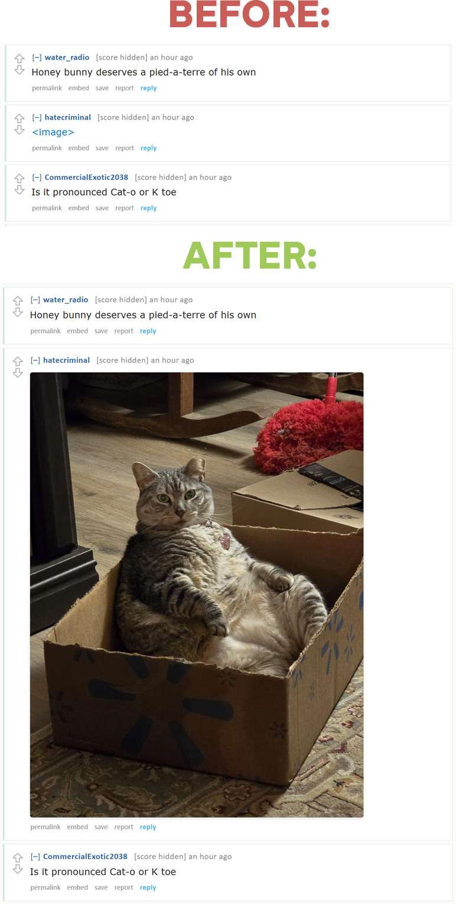
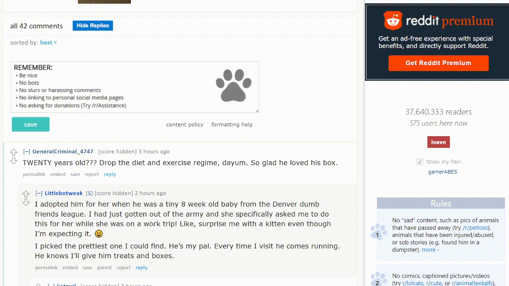

# Old Reddit Show Image 🖼️

A Chrome extension that enhances your old Reddit browsing experience by automatically displaying images inline and adding convenient reply management controls.


## ✨ Features

### 🖼️ **Automatic Image Display**
- Replaces `<image>` link text with actual inline images
- Sets max-width to 500px for optimal viewing
- Works with Reddit images, Imgur, and other image hosts
- Includes error handling for broken images

### 💬 **Reply Toggle Control**
- Adds a "Toggle Replies" button to comment threads
- Hide/show all child comments with one click
- Works with dynamically loaded content
- Maintains state when new comments are loaded

### ⚡ **Smart Detection**
- Automatically processes new content as it loads
- Works with infinite scroll and dynamic updates
- Lightweight and efficient

## 🚀 Installation

### Method 1: Download and Install (Recommended)

1. **Download the extension:**
   - Clone this repository: `git clone https://github.com/mnewelski/old-reddit-show-image.git`
   - Or download as ZIP and extract

2. **Install in Chrome:**
   - Open Chrome and navigate to `chrome://extensions/`
   - Enable "Developer mode" (toggle in top right)
   - Click "Load unpacked"
   - Select the folder containing the extension files

3. **You're done!** 🎉
   - Visit any Reddit thread and see the magic happen
   - Look for the "Toggle Replies" button in comment sections

### Method 2: Quick Install (ZIP)

1. Download the [latest release](https://github.com/mnewelski/old-reddit-show-image/releases/download/v1.0/old-reddit-show-image-v1.0.zip) ZIP file
2. Extract the ZIP file to a folder
3. Follow steps 2-3 from Method 1 above

## 📸 Screenshots & Demo

### Before & After Image Display


### Reply Toggle Functionality
Watch how easy it is to hide/show replies:



### Example Usage
```
Original: <image>
Becomes:  [Beautiful inline image with 500px max width]
```

## 🛠️ Technical Details

### Files Structure
```
old-reddit-show-image/
├── manifest.json          # Extension configuration
├── content.js            # Main functionality
├── icon16.png           # Small icon (optional)
├── icon48.png           # Medium icon (optional)
├── icon128.png          # Large icon (optional)
├── README.md            # This file
├── screenshots/         # Demo images and videos
│   ├── before-after.jpg
│   └── comments-hide-show.gif
└── releases/           # Pre-built extension packages
    └── old-reddit-show-image-v1.0.zip
```

### How It Works
- **Content Script**: Runs on all Reddit pages
- **MutationObserver**: Detects dynamically loaded content
- **CSS Injection**: Applies styles directly to the page
- **Event Listeners**: Handles user interactions

### Browser Support
- ✅ Chrome (Manifest V3)
- ✅ Edge (Chromium-based)
- ❓ Firefox (may need adaptation)

## 🔧 Development

### Prerequisites
- Chrome browser
- Basic knowledge of HTML/CSS/JavaScript

### Local Development
1. Make changes to the code
2. Go to `chrome://extensions/`
3. Click the refresh icon on the extension card
4. Reload any Reddit pages to see changes

### Contributing
1. Fork the repository
2. Create a feature branch
3. Make your changes
4. Test thoroughly on various Reddit threads
5. Submit a pull request

## 📝 Changelog

### v1.0.0
- Initial release
- Image replacement functionality
- Toggle replies feature
- Dynamic content support

## 🐛 Known Issues

- Some images may not load due to CORS restrictions
- Very old Reddit threads might have different HTML structure
- Extension only works on old Reddit interface

## 🤝 Contributing

Found a bug? Have a feature request? Contributions are welcome!

1. Check existing issues first
2. Create a new issue with detailed description
3. Fork and create a pull request

## 📄 License

This project is licensed under the MIT License - see the [LICENSE](LICENSE) file for details.

## 🙏 Acknowledgments

- Reddit for providing the old interface
- Chrome Extensions API documentation
- All the users who will hopefully enjoy this extension!

## 📞 Support

If you encounter any issues:
1. Check the [Issues](https://github.com/mnewelski/old-reddit-show-image/issues) section
2. Create a new issue with:
   - Chrome version
   - Extension version
   - Steps to reproduce
   - Screenshots if applicable

## 🔗 Repository
**GitHub:** https://github.com/mnewelski/old-reddit-show-image

---

**⭐ If you find this extension helpful, please give it a star!**

Made with ❤️ for the Reddit community